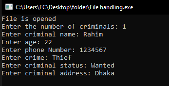
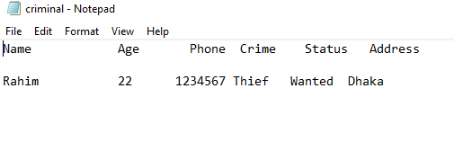

# C Criminal Record File System

A simple file handling project written in C that stores criminal records in a text file.

## Features

- Store criminal records
- Take user input
- Save data into a file
- Use file handling functions in C

## Technologies Used

- C Programming

## Program Output

## Saved Data (criminal.txt)

## Output

The program collects criminal information from the user and saves it into a text file.
